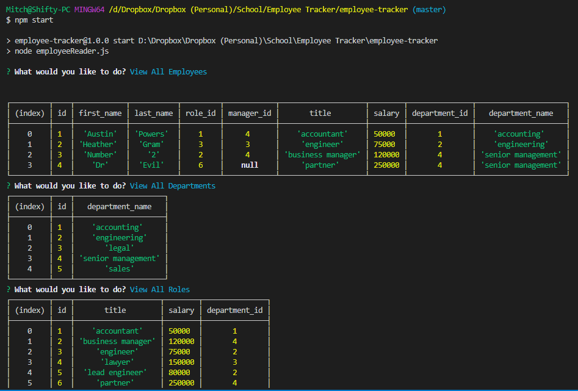

# Employee Tracker

## Description

A node application for storing employee data such as role, salary and management hierarchy.

## Table of Contents

* [Installation](#installation)
* [Usage](#usage)
* [Credits](#credits)
* [License](#license)

## Installation

1. Download project files.
2. Run 'npm install'

## Usage

1. Run 'npm start'
2. View All Employees
3. Add New Employees
4. Delete Exisiting Employees
5. Update Exisiting Employees

## Credits

[Mitch Henderson](https://shiftymitch.github.io/portfolio/2)
-Wrote employeeReader.js & employee_db schema file.

## License

## Contributing

No contributing necessary. Just clone the repo and make adjustments as needed.

## Questions

Questions can be directed via email to shiftymitch@gmail.com